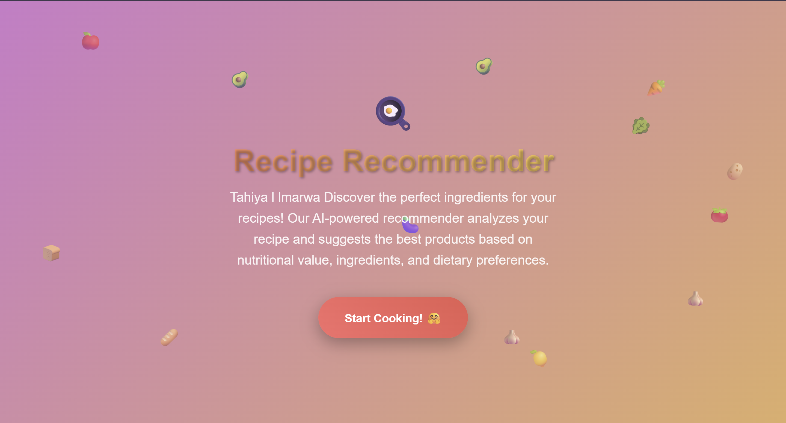
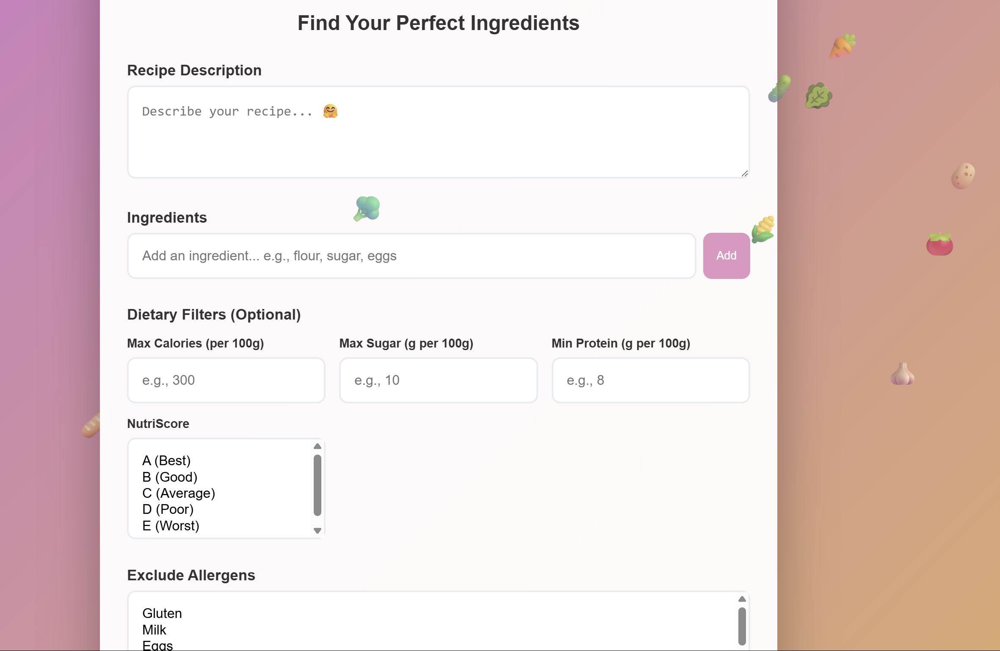
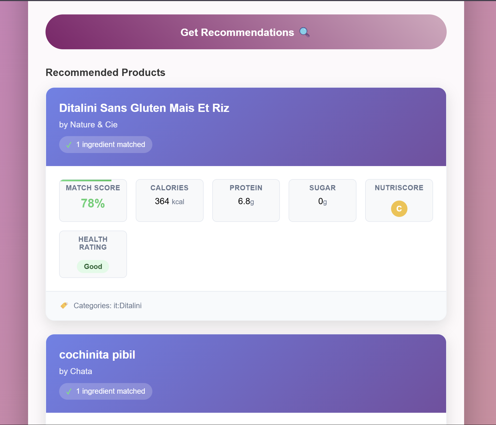

# Recipe Recommendation System 🍳

An AI-powered food product recommendation system that helps users discover the perfect ingredients for their recipes based on nutritional value, dietary preferences, and ingredient matching.

## 🌟 Features

### 🔍 Smart Recipe Analysis
- **Recipe Description Input**: Describe your recipe
- **Ingredient Matching**: AI analyzes and matches ingredients with available products
- **Multi-language Support**: Interface available in French 

### 🥗 Advanced Filtering Options
- **Nutritional Filters**:
- Maximum Calories (per 100g)
- Maximum Sugar content (g per 100g)
- Minimum Protein content (g per 100g)
- **NutriScore Integration**: Filter by health ratings (A-E scale)
- **Allergen Management**: Exclude specific allergens (Gluten, Milk, Eggs, etc.)

### Detailed Product Information
- **Match Score**: Percentage-based ingredient compatibility
- **Nutritional Data**: Calories, Protein, Sugar content
- **Health Rating**: NutriScore classification
- **Brand Information**: Product manufacturer details
- **Category Classification**: Product categorization

##  Getting Started

### Prerequisites
```bash
python 3.8+
pandas
numpy
scikit-learn
html css js  (for web interface)
```

## 📁 Project Structure
```
Product_Food_Recommendation_System/
├── French-dataset/
│   └── cleaned_data.csv          
├── models/
│   └── recipe_recommender2.pkl   
├── images/
│   ├── im1.png         
│   ├── im2.png         
│   └── im3.png      
├── app.py                                     
├── .gitattributes              
└── README.md                    
```

## 🔧 How It Works

1. **Recipe Input**: Users describe their recipe in the text area
2. **Ingredient Extraction**: AI processes the description to identify key ingredients
3. **Product Matching**: Algorithm searches the French product database for compatible items
4. **Filtering**: Applied dietary and nutritional filters narrow down results
5. **Scoring**: Each product receives a match score based on ingredient compatibility
6. **Recommendation**: Top-rated products are displayed with detailed nutritional information


## 🛠️ Technical Stack

- **Backend**: Python, Pandas, NumPy
- **Machine Learning**: Scikit-learn, Custom recommendation algorithms
- **Frontend**: html with custom CSS styling and js
- **Data Storage**: CSV database with Git LFS for large files
- **Deployment**: not yet 

## 🎨 User Interface


#### 1. Landing Page


#### 2. Recipe Input Interface

*User-friendly form for entering recipe descriptions, ingredients, and dietary preferences*

#### 3. Product Recommendations

*Detailed product cards showing match scores, nutritional information, and health ratings*

### Design Features
- **Modern Gradient Design**: Purple-pink aesthetic with floating food icons
- **Intuitive Forms**: Easy-to-use input fields for recipes and preferences
- **Responsive Cards**: Clean product display with key metrics
- **Interactive Filters**: Real-time filtering capabilities
- **Multi-language Support**: Interface text in French (Tahiya | Imarwa)
- **Professional Layout**: Clean, modern design with excellent UX/UI

## 🤝 Contributing

1. Fork the repository
2. Create a feature branch (`git checkout -b feature/AmazingFeature`)
3. Commit your changes (`git commit -m 'Add some AmazingFeature'`)
4. Push to the branch (`git push origin feature/AmazingFeature`)
5. Open a Pull Request

## 👨‍💻 Author

**Insaf Badri**
**marwa sghir**
- GitHub: [@Insaf-Badri](https://github.com/Insaf-Badri)
- Project: [Product Food Recommendation System](https://github.com/Insaf-Badri/Product_Food_Recommendation_-System)


Discover the perfect ingredients for your recipes! 🍽️*
